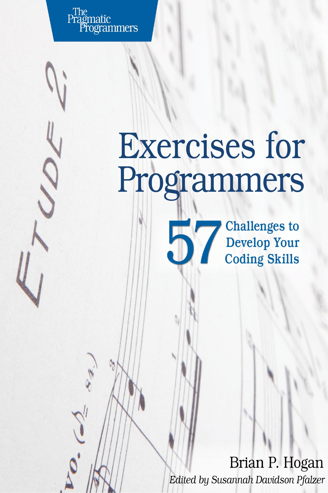

# Exercises for Programmers

#### Progress...

Chapter | Title | Done
------- | ----- | ----
01 | Exercise - 01 | :heavy_check_mark:
02 | Exercise - 02 | :heavy_check_mark:
03 | Exercise - 03 | :heavy_check_mark:
04 | Exercise - 04 | :heavy_check_mark:
05 | Exercise - 05 | :heavy_check_mark:
06 | Exercise - 06 | :heavy_check_mark:
07 | Exercise - 07 | :heavy_check_mark:
08 | Exercise - 08 | :heavy_check_mark:
09 | Exercise - 09 | :heavy_check_mark:
10 | Exercise - 10 | :heavy_check_mark:
11 | Exercise - 11 | :heavy_check_mark:
12 | Exercise - 12 | :heavy_check_mark:
13 | Exercise - 13 | :heavy_check_mark:
14 | Exercise - 14 | :heavy_check_mark:
15 | Exercise - 15 | :heavy_check_mark:
16 | Exercise - 16 | :heavy_check_mark:
17 | Exercise - 17 | :heavy_check_mark:
18 | Exercise - 18 | :heavy_check_mark:
19 | Exercise - 19 | :heavy_check_mark:
20 | Exercise - 20 | :heavy_check_mark:
21 | Exercise - 21 | :heavy_check_mark:
22 | Exercise - 22 | :heavy_check_mark:
23 | Exercise - 23 | :heavy_check_mark:
24 | Exercise - 24 | 
25 | Exercise - 25 | 
26 | Exercise - 26 | 
27 | Exercise - 27 | 
28 | Exercise - 28 | 
29 | Exercise - 29 | 
30 | Exercise - 30 | 
31 | Exercise - 31 | 
32 | Exercise - 32 | 
33 | Exercise - 33 | 
34 | Exercise - 34 | 
35 | Exercise - 35 | 
36 | Exercise - 36 | 
37 | Exercise - 37 | 
38 | Exercise - 38 | 
39 | Exercise - 39 | 
40 | Exercise - 40 | 
41 | Exercise - 41 | 
42 | Exercise - 42 | 
43 | Exercise - 43 | 
44 | Exercise - 44 | 
45 | Exercise - 45 | 
46 | Exercise - 46 | 
47 | Exercise - 47 | 
48 | Exercise - 48 | 
49 | Exercise - 49 | 
50 | Exercise - 50 | 
51 | Exercise - 51 | 
52 | Exercise - 52 | 
53 | Exercise - 53 | 
54 | Exercise - 54 | 
55 | Exercise - 55 | 
56 | Exercise - 56 | 
57 | Exercise - 57 | 
